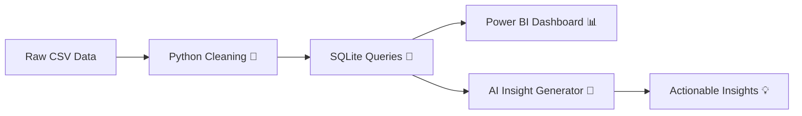

# superstore-analytics-ai
<!-- ──────────────────────────────── -->
<!-- 🔮 SUPERSTORE ANALYTICS + AI INSIGHTS -->
<!-- ──────────────────────────────── -->

> _“Data never sleeps — and neither do we.”_  
> A futuristic project blending **Python**, **SQL**, **Power BI**, and **AI** to uncover hidden business intelligence.  
> Created by **Papimon Kongnark** 👩🏻‍💻✨

---

## ⚙️ Tech Stack
| 💻 Language | 🧩 Tool / Library | 🚀 Purpose |
|--------------|-------------------|-------------|
| Python 🐍 | pandas, numpy, openai | Data Cleaning & AI Insight |
| SQL 🗃️ | SQLite | Query & Data Analysis |
| Power BI 📊 | Dashboard | Data Visualization |
| GitHub 🌐 | Portfolio | Showcase Project |

---

## 🧠 Data Flow

## ⚡ Key Features

🧹 Data Cleaning — Handle missing values, fix date formats, and add derived metrics

🧮 SQL Query — Analyze total sales, profit margin, and top-performing customers

📊 Power BI Dashboard — Interactive visuals: Sales by Category, Region, Year

🤖 AI Insight Generator — Python + OpenAI model automatically summarizes key findings in Thai + English

🧠 Cyberpunk Design — Futuristic style README and data storytelling
